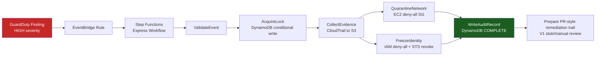

# Aegis-Flow

[](https://github.com/rblea97/aegis-flow/actions/workflows/ci.yml)

Aegis-Flow is an AWS security automation demo that turns high-severity GuardDuty findings into a repeatable remediation workflow: validate the alert, collect evidence, quarantine the resource, freeze risky identities, and write an audit trail.

**V1 focus:** safe local validation with LocalStack/moto, recruiter-readable architecture, and sanitized public evidence. No real AWS account IDs or secrets are required to review or run the demo.


## Demo

Start here: [DEMO.md](DEMO.md)

The demo walks through the V1 story using local AWS emulation:

- run fast unit tests with moto;
- deploy the CDK stacks to LocalStack;
- execute integration checks for compute and identity playbooks;
- verify the durable remediation state with the Boto3 audit script.

The public execution example uses redacted account placeholders:

```text
AegisFlow Remediation Audit - arn:aws:iam::<ACCOUNT_ID>:role/aegisflow-demo-victim
============================================================
PASS  DynamoDB status: COMPLETE
PASS  IAM Deny-All policy: present
PASS  Evidence collection: success

AUDIT PASSED
```

## Live AWS Verification

Real-account E2E verification ran on 2026-05-20 using sanitized evidence only. AWS identity preflight passed for `<ACCOUNT_ID>` in `<REGION>`, suffix-scoped CDK stacks deployed, a disposable EC2 target was remediated through Step Functions/Lambda, DynamoDB reached `COMPLETE`, S3 evidence metadata existed without exposing object contents, the disposable instance role received the deny-all policy, the EC2 target was moved to the quarantine security group, and cleanup was verified.

The live run also found two real cloud-only gaps that were fixed with tests: collision-prone fixed physical names now support `AEGISFLOW_NAME_SUFFIX`, and the remediation role now includes the `iam:GetInstanceProfile` permission required to freeze an EC2 instance role. See [docs/live-aws-verification.md](docs/live-aws-verification.md) for the verification table and redaction notes.

## Key Features

- **Finding-driven remediation** — EventBridge routes high-severity GuardDuty-style findings into an Express Step Functions workflow.
- **Evidence before enforcement** — CloudTrail evidence is written before quarantine or identity controls run.
- **Compute quarantine** — EC2 findings replace target security groups with a deny-all quarantine group.
- **Identity freeze** — IAM findings attach a deny-all policy and revoke STS sessions where applicable.
- **Idempotent audit trail** — DynamoDB conditional writes prevent duplicate remediation records for the same resource.

## Architecture



Two CDK stacks keep infrastructure concerns separated:

- **FoundationStack** — VPC, quarantine security group, S3 forensics bucket, DynamoDB jail table, IAM roles.
- **PipelineStack** — Lambda dispatcher, Step Functions Express workflow, EventBridge GuardDuty rule, SNS alerts, CloudWatch logs.

Full design notes: [ARCHITECTURE.md](ARCHITECTURE.md)

## Quick Start

Prerequisites: Windows PowerShell, Docker Desktop, Node.js, Python 3.12+

```powershell
# Install Python and CDK dependencies
python -m venv .venv
.\.venv\Scripts\python.exe -m pip install -r lambda\requirements.txt -r lambda\requirements-dev.txt
cd cdk
npm install
cd ..

# Run fast checks, no AWS account needed
.\.venv\Scripts\python.exe -m ruff check lambda scripts tests
.\.venv\Scripts\python.exe -m pip_audit -r lambda\requirements.txt -r lambda\requirements-dev.txt
.\.venv\Scripts\python.exe -m pytest tests/unit -q
cd cdk
npm audit --audit-level=high
npm run build
npm test -- --runInBand
cd ..
```

Run the full local demo:

```powershell
docker compose up -d

cd cdk
$env:AWS_ACCESS_KEY_ID='test'
$env:AWS_SECRET_ACCESS_KEY='test'
$env:AWS_DEFAULT_REGION='us-east-1'
$env:CDK_DEFAULT_ACCOUNT='000000000000'
$env:CDK_DEFAULT_REGION='us-east-1'
$env:AEGISFLOW_LOCALSTACK='1'
$env:NODE_PATH=(Resolve-Path '.\node_modules').Path
npx aws-cdk-local@3.0.4 bootstrap aws://000000000000/us-east-1
npx aws-cdk-local@3.0.4 deploy --all --require-approval never
cd ..

.\.venv\Scripts\python.exe -m pytest tests/integration -q --timeout=30
```

## Tech Stack

| Technology | Why |
|---|---|
| Python 3.12 Lambda | clear remediation logic, type hints, boto3 ecosystem |
| AWS CDK TypeScript | repeatable infrastructure with testable CloudFormation synthesis |
| Step Functions Express | ordered workflow, retries, failure routing, execution logs |
| GuardDuty + EventBridge | event-driven detection path without polling |
| DynamoDB | conditional writes for idempotency and durable audit state |
| S3 | versioned forensic evidence storage |
| LocalStack 3 | local AWS emulation for integration tests without cloud cost |
| pytest + moto | fast unit coverage with deterministic AWS mocks |

## Challenges and Solutions

- **LocalStack Express workflow limits** — Integration tests validate durable AWS state instead of relying on `DescribeExecution`, which is limited for Express workflows in local emulation.
- **Duplicate finding protection** — `AcquireLock` uses a DynamoDB conditional write on `resource_arn`, so concurrent findings cannot create duplicate jail records.
- **Evidence-first remediation** — The workflow collects CloudTrail evidence before enforcement, preserving investigative context even if a later quarantine step fails.
- **Live-run namespacing** — `AEGISFLOW_NAME_SUFFIX` can namespace collision-prone physical resource names for disposable real-account validation.
- **Honest PR trail in V1** — The workflow currently prepares PR-style remediation metadata through a stubbed function. It does not claim to open a real GitHub PR until that integration is implemented.
- **Constrained AI-assisted development** — AI-generated code is treated as untrusted until static analysis, Python dependency auditing, npm high-severity auditing, unit tests, CDK synthesis tests, and CI workflows validate it.

## Security Notes

This is a portfolio demonstration, not a production security product. Public docs and demo outputs use placeholders such as `<ACCOUNT_ID>` and LocalStack account `000000000000`; do not commit real account IDs, credentials, session tokens, or CloudTrail records.

See [SECURITY.md](SECURITY.md) for the security model and vulnerability reporting guidance.

## License

MIT - see [LICENSE](LICENSE)
