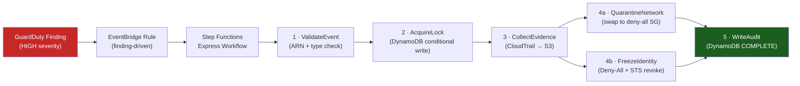

# Aegis-Flow

[](https://github.com/rblea97/aegis-flow/actions/workflows/ci.yml)

When a GuardDuty finding fires, you have minutes before an attacker establishes persistence. Aegis-Flow turns that alert into automated remediation — quarantining EC2 instances, freezing IAM identities, collecting forensic evidence — without human intervention.

**Validated on real AWS: compromised IAM identity locked and audited in 4.1 seconds.**


---

## Live Execution

IAM role `aegisflow-demo-victim` targeted with a `PrivilegeEscalation:IAMUser/AdministrativePermissions` finding. All 7 states completed on real AWS (account 560904638100, us-west-1):

~~~text
{
    "status": "SUCCEEDED",
    "billingDetails": {
        "billedMemoryUsedInMB": 64,
        "billedDurationInMilliseconds": 4100
    },
    "output": {
        "lockResult":     { "Payload": { "locked": true } },
        "evidenceResult": { "Payload": { "evidence_collection_status": "success" } },
        "networkResult":  { "Payload": { "action_taken": "skipped", "reason": "identity finding - no EC2 resource" } },
        "identityResult": { "Payload": { "action_taken": "deny_policy_attached_with_sts_revocation", "sts_sessions_revoked": true } },
        "auditResult":    { "Payload": { "audit_written": true } }
    }
}
~~~

Post-execution audit (independent Boto3 script, exits non-zero on any gap):

~~~text
============================================================
AegisFlow Remediation Audit - arn:aws:iam::560904638100:role/aegisflow-demo-victim
============================================================
PASS  DynamoDB status: COMPLETE
PASS  IAM Deny-All policy: present
PASS  Evidence collection: success

AUDIT PASSED
~~~

---

## Architecture



Two CDK stacks:

- **FoundationStack** — VPC, quarantine security group, S3 forensics bucket (versioned, Glacier lifecycle), DynamoDB jail table, IAM roles
- **PipelineStack** — Lambda dispatcher, Step Functions Express workflow, EventBridge GuardDuty rule, SNS alerts, CloudWatch logs

---

## Key Engineering Decisions

| Decision | Why |
|---|---|
| **STS role chaining** | `RemediatorLambdaRole` has zero direct AWS permissions — only `sts:AssumeRole`. All real API calls require assuming `RemediationExecutionRole`. Confused-deputy attack prevented via `aws:SourceArn` condition. |
| **Evidence before enforcement** | CloudTrail events captured to S3 before any quarantine or IAM action. The attack chain is preserved even if enforcement fails mid-execution. |
| **DynamoDB conditional write for locking** | Two concurrent findings for the same resource produce exactly one jail record. `ConditionExpression: attribute_not_exists(resource_arn)` is atomic — no distributed lock, no transaction. |
| **Post-state assertions over SFN polling** | LocalStack doesn't emulate Express Step Functions execution end-to-end. Tests assert durable state (DynamoDB status, IAM policy presence, EC2 SG membership) — the same definition of done as production. |

---

## Test Coverage

16 unit tests against in-process moto mocks — no LocalStack or AWS account required:

~~~text
tests/unit/test_audit.py::test_write_audit_record_sets_complete         PASSED
tests/unit/test_audit.py::test_write_failed_record_sets_error           PASSED
tests/unit/test_evidence.py::test_compute_evidence_returns_status_field  PASSED
tests/unit/test_evidence.py::test_identity_evidence_returns_status_field PASSED
tests/unit/test_handler.py::test_handler_rejects_unknown_action          PASSED
tests/unit/test_handler.py::test_handler_validate_event_returns_context  PASSED
tests/unit/test_identity.py::test_compute_attaches_deny_policy           PASSED
tests/unit/test_identity.py::test_identity_attaches_deny_and_revokes_sts PASSED
tests/unit/test_locker.py::test_acquire_lock_writes_locked_status        PASSED
tests/unit/test_locker.py::test_acquire_lock_raises_on_duplicate         PASSED
tests/unit/test_network.py::test_compute_quarantine_swaps_sg             PASSED
tests/unit/test_network.py::test_identity_quarantine_is_noop             PASSED
tests/unit/test_validator.py::test_validate_cryptomining_returns_context PASSED
tests/unit/test_validator.py::test_validate_console_login_returns_context PASSED
tests/unit/test_validator.py::test_validate_rejects_invalid_arn          PASSED
tests/unit/test_validator.py::test_validate_rejects_unknown_finding_type PASSED

16 passed in 2.27s
~~~

Integration tests (LocalStack) assert durable post-state rather than polling `DescribeExecution`. CDK infrastructure validated with 3 Jest assertions against synthesized CloudFormation templates.

---

## Tech Stack

| Technology | Why |
|---|---|
| Python 3.12 Lambda | async-friendly, rich boto3 ecosystem |
| AWS CDK (TypeScript) | repeatable infra-as-code; two-stack design enforces separation of concerns |
| Step Functions Express | built-in retry, parallel branches, error routing, full execution audit trail |
| GuardDuty + EventBridge | finding-driven routing eliminates polling; HIGH severity filter reduces noise |
| DynamoDB (pay-per-request) | conditional writes for idempotency; TTL for automatic jail record expiry |
| S3 (versioned + Glacier) | tamper-evident forensics storage; lifecycle transitions to cold storage |
| LocalStack 3 | full local AWS emulation for CI without an account or cost |
| pytest + moto | in-process AWS mocks; fast, deterministic, zero network dependency |

---

## Challenges and Solutions

- **LocalStack partial Express Step Functions support** — LocalStack 3 doesn't execute Express state machines identically to real AWS. Integration tests were redesigned to assert durable post-state (DynamoDB `status = COMPLETE`, IAM policy presence, EC2 security group membership) rather than polling `DescribeExecution`. This is actually a stronger test: it validates the ground truth, not the execution response.

- **Conditional DynamoDB locking without transactions** — Two concurrent findings for the same resource must produce exactly one jail record without a distributed lock. `AcquireLock` uses `ConditionExpression: attribute_not_exists(resource_arn)` — atomic, no transaction overhead. The second execution exits cleanly via `AlreadyLocked`.

- **CDK bootstrap ownership conflict with LocalStack init** — LocalStack's init script and CDK bootstrap both attempt to create foundational resources. The init script was scoped to raw infrastructure only (VPC, security groups, S3, DynamoDB). CDK owns IAM roles, Lambda, and Step Functions — making `cdklocal deploy` the single source of truth for the orchestration layer.

---

## Quick Start

Prerequisites: Windows PowerShell, Docker Desktop, Node.js, Python 3.12+

```powershell
# Install dependencies
python -m venv .venv
.\.venv\Scripts\python.exe -m pip install -r lambda\requirements.txt -r lambda\requirements-dev.txt
cd cdk && npm install && cd ..

# Run unit tests (no AWS account needed)
.\.venv\Scripts\python.exe -m pytest tests/unit -q
cd cdk && npm test -- --runInBand && cd ..

# Run LocalStack integration tests
docker compose up -d
cd cdk
$env:AWS_ACCESS_KEY_ID='test'; $env:AWS_SECRET_ACCESS_KEY='test'
$env:AWS_DEFAULT_REGION='us-east-1'; $env:CDK_DEFAULT_ACCOUNT='000000000000'
$env:CDK_DEFAULT_REGION='us-east-1'; $env:AEGISFLOW_LOCALSTACK='1'
$env:NODE_PATH=(Resolve-Path '.\node_modules').Path
npx aws-cdk-local@3.0.4 bootstrap aws://000000000000/us-east-1
npx aws-cdk-local@3.0.4 deploy --all --require-approval never
cd ..
.\.venv\Scripts\python.exe -m pytest tests/integration -q --timeout=30
```

Post-remediation audit (verifies DynamoDB record, IAM policy, and evidence collection):

```powershell
.\.venv\Scripts\python.exe scripts\verify_remediation.py `
  --resource-arn "<resource ARN>" `
  --endpoint "http://localhost:4566"
```

Full architecture and state machine design: [ARCHITECTURE.md](ARCHITECTURE.md)

---

## License

MIT — see [LICENSE](LICENSE)
